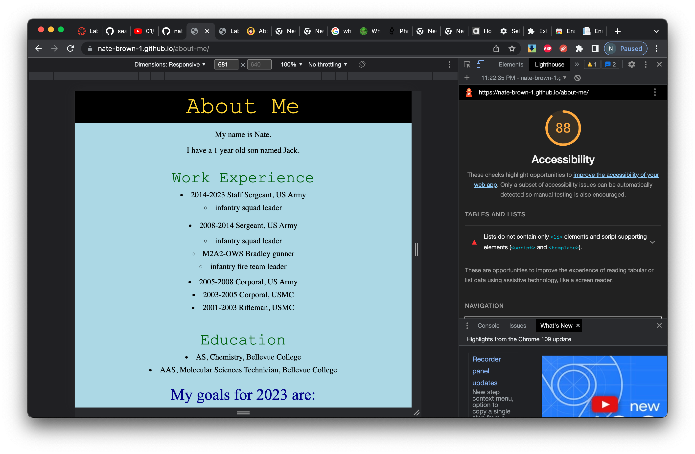

# CURRENT REVISION: LAB 05B

## About Me

I built a page about myself which gives the user a short pop quiz asking a series of yes or no questions.

### Author: Student/Group Name

- Code written by Nate Brown
- Based on demo code written in class by Sheyna Watkins

### Links and Resources

- I used this site to make the header flex box with vertical/horizontal centering
  - <https://www.w3docs.com/snippets/css/how-to-vertically-center-text-with-css.html>
- Random number generator made with help from this site
  - <https://www.w3schools.com/js/js_random.asp>

### Lighthouse Accessibility Report Score

Report obtained Sun Jan 29 2226



### Reflections and Comments

- CSS still needs help but no time
- Class provided ESLint file was modified with the following addition to permit use of template literals enclosed in backticks (`)

``` JSON
    "quotes": [
      "warn",
      "single",
      {
        "exceptions": {
          "allowTemplateLiterals": true
        }
      }
```
